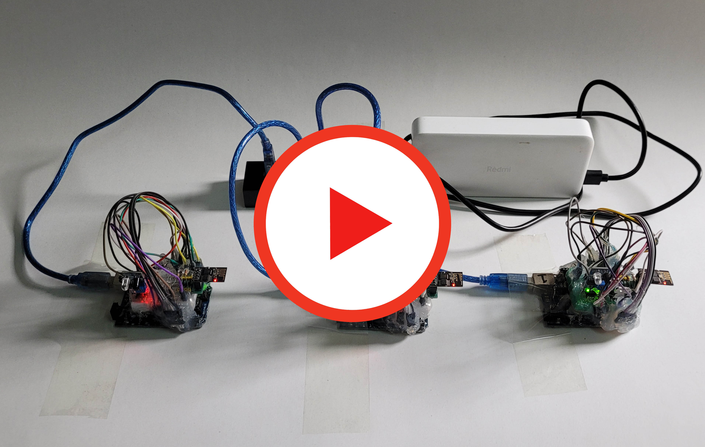
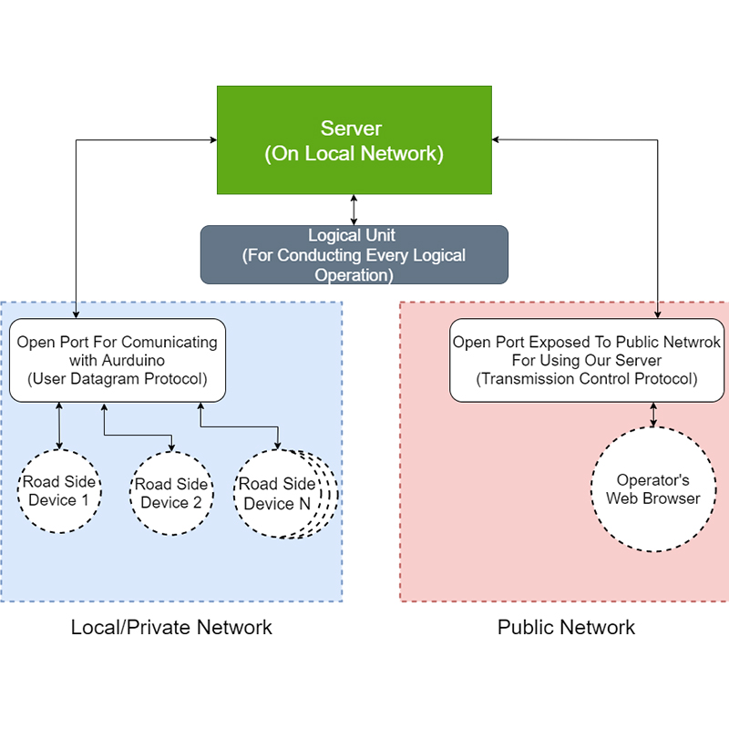
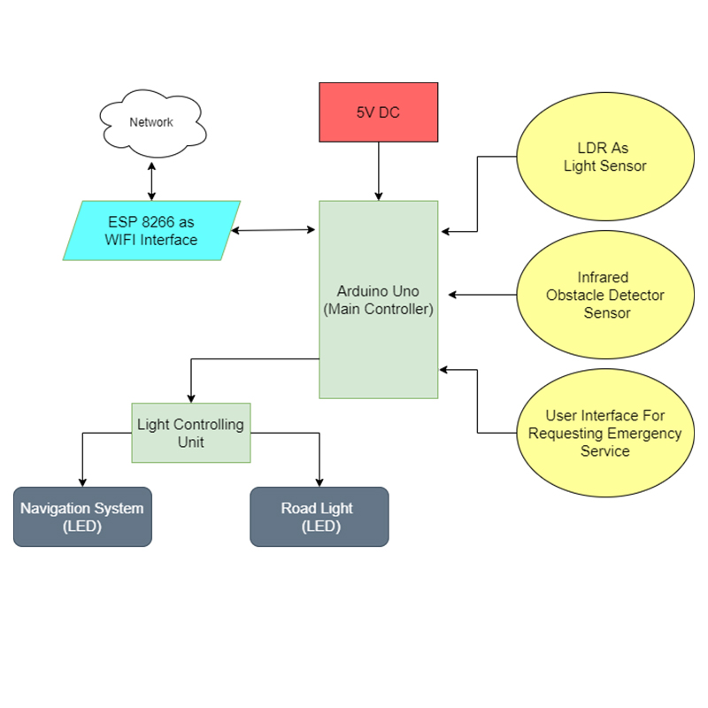
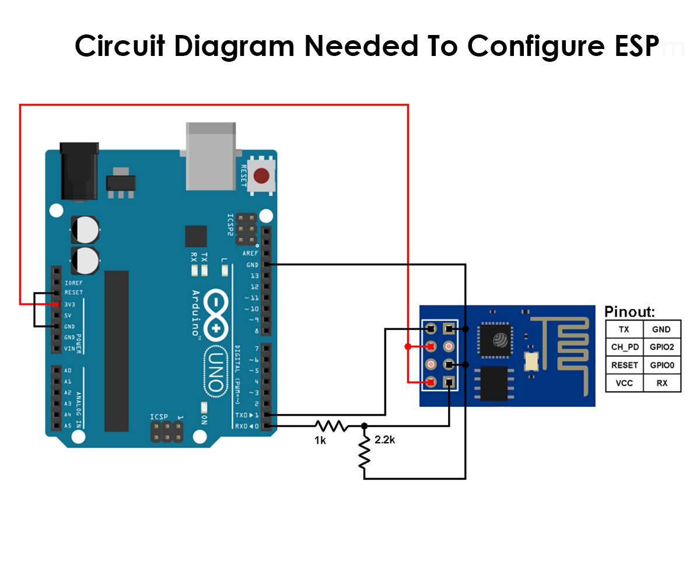
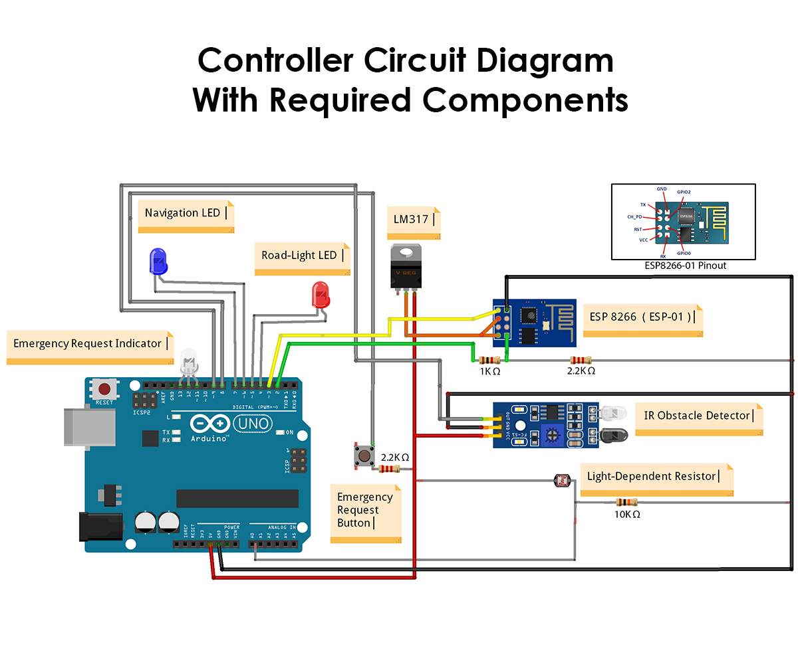

# About
The project is about a Iot based smart highway management system. The system can automate light (road lamps), can warn drivers about vehicles ahead of them and can allow a user to communicate in an emergency.
Watch video to understand more.

 

# Prototype 

 

# Specification
The project can be divided into two core parts. 
<ul>
   <li>
      <h2>Server </h2>
      <ul>
         
Server connects multiple controller through local network. Then it provides an   interface to for specific tasks of the system. It uses broadcast protocols for communication with its slave (controllers). For better understanding see block diagram.

      </ul>
   </li>
   <li>
      <h2>Controller </h2>
      <ul>
         
Controllers are device which collects data and send to server and follow server's instruction. It uses ESP  as as wifi module and connects to server with unique id. It uses UDP protocol to communicate with server. For better understanding see block diagram and circuit diagram.  

      </ul>
   </li>
</ul>

 

# Block Diagram
<ul>
  <li>
      
 <h2>Server</h2> 

      
   </li>
  
  <li>
      
 <h2>Controller</h2> 

      
   </li>
</ul>

 

# Circuit Diagram
<ul>
  <li>
      
 <h2>ESP 8266</h2> 

      
   </li>
  
  <li>
      
 <h2>Controller</h2> 

      
   </li>
</ul>

 

# Steps To Build
<ol>
  <li> 
    
Configure ESP: First configure ESP module so that it can be used as a interface for Arduino UNO. Follow circuit diagram to build up the circuit. Then use the script "ESP.ino". Follow this <a href="https://arduino-esp8266.readthedocs.io/en/latest/esp8266wifi/readme.html">link</a> to add required header and also for compilation

  </li>
  <li> 
    
Configure Arduino: Prepare circuit as described in the diagram. Use the script "Controller.ino". Before uploading the script to Arduino add valid network configuration to the script parameter. For better understanding read the comments beside variables like "WiFi Name", "Server IP". Here server ip is  the local ip address of computer in which the server is running.

  </li>
  <li> 
    
Server: Download Intellij IDE (or any which you prefer). Provide broadcast address of the network. It should be the last address of any network.

  </li>

  <li> 
    
Start The System: Start the server first. After successfully starting the server start those controllers.

  </li>

</ol>

 

# Note
To run the server, add a new Run configuration and select the "Main" class as the entry point, which is inside "src/Main.java" (Assuming the IDE is IntelliJ).
 
JDK Version : openjdk 20.0.1
 
# Contribution
<ul>
   <li> Thank you for your ideas and assistance in designing the prototype,
    <a href="https://github.com/TowasinAlam">Towasin Alam.</a> </li>

</ul>
